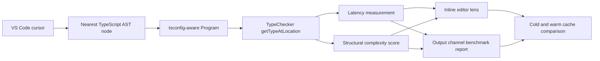

# TSPerf Type Lens


TSPerf Type Lens is an MIT-licensed VS Code extension for inspecting TypeScript type-checker latency and structural type complexity at the cursor.

It is built for the Algora TSPerf challenge: build a VS Code plugin that shows the complexity and time to load of a TypeScript type.

## Features

- `TSPerf: Inspect Type at Cursor` measures the selected node with the TypeScript compiler API.
- Inline editor decoration shows `TSPerf <ms> | score <n>` next to the inspected symbol.
- Output channel reports file, node kind, type text, program build time, type resolution time, cache state, and score factors.
- `TSPerf: Benchmark Current File` walks representative identifiers in the active file and reports average, p95, and max type resolution time.
- `TSPerf: Clear Measurement Cache` resets warm measurements.

## How It Works

The extension finds the nearest `tsconfig.json` for the active file and builds a TypeScript `Program`. If no config exists, it creates a single-file program with strict defaults. It then maps the VS Code cursor position to a TypeScript AST node, calls `checker.getTypeAtLocation`, and scores the returned type from:



- union and intersection breadth
- property count
- call and construct signatures
- generic type arguments
- recursive child-type depth
- rendered type length

Measurements are cached by file URI, document version, cursor offset, and TypeScript compiler option signature so repeated inspections distinguish cold and warm paths.

## Development

```bash
npm install
npm run check
npm run build
npm run package
npm run verify:package
```

Install the generated `.vsix` with:

```bash
code --install-extension tsperf-type-lens-0.1.2.vsix
```

## Challenge Submission Evidence

This repository includes:

- source for a functional VS Code extension
- MIT license
- architecture visual and Mermaid flow for fast reviewer orientation
- benchmark fixture under `fixtures/pathological-types.ts`
- TypeScript build configuration
- VSIX packaging script
- package verification that rejects dependency folders, source folders, and macOS AppleDouble metadata from the generated VSIX
